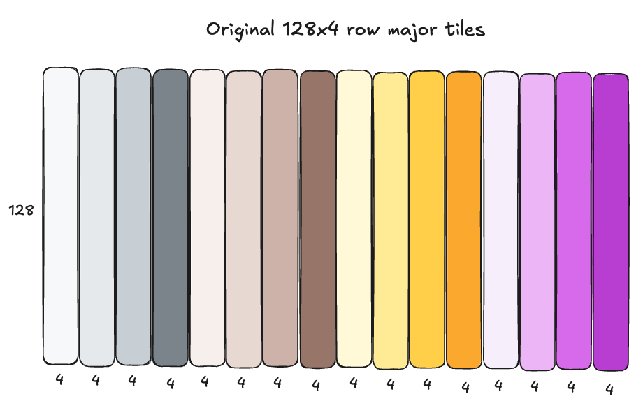
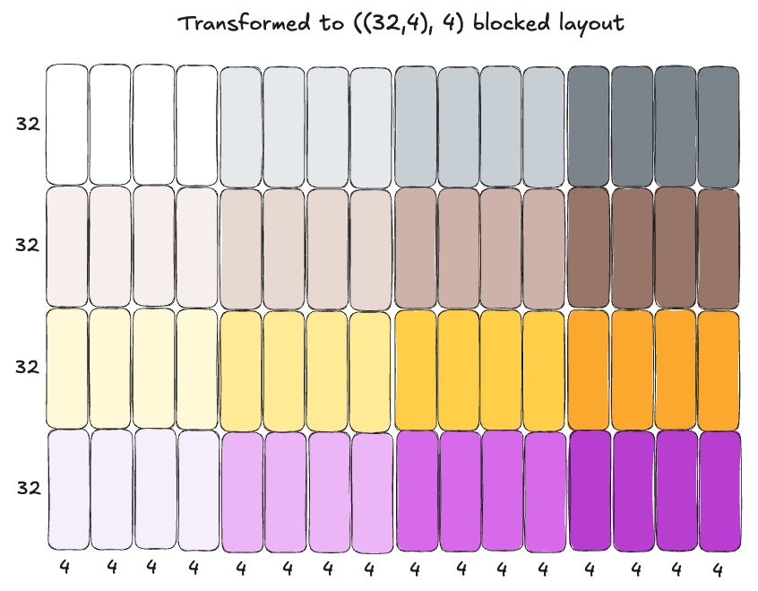
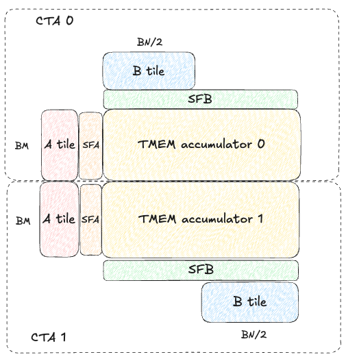
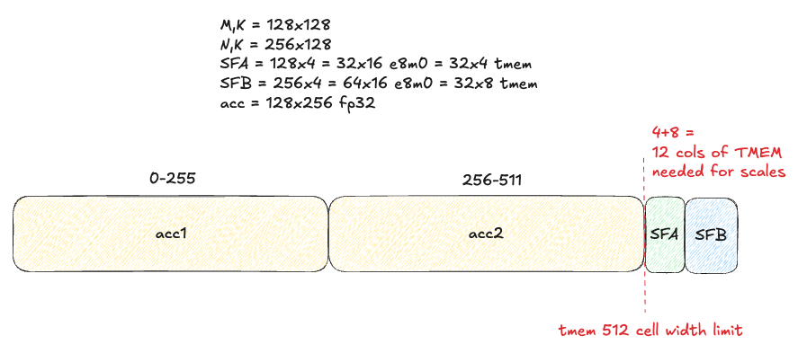
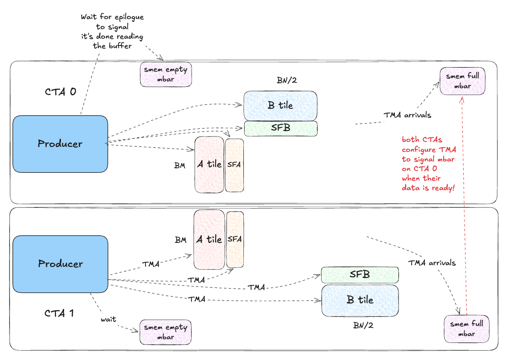

I recently did a deep-dive on writing GEMM kernels with just CUDA + PTX for Ampere, Hopper, and Blackwell GPUs, culminating in a MXFP8 GEMM [kernel](https://github.com/danielvegamyhre/gemm/blob/main/blackwell/mxfp8/3_tcgen05_mxfp8_2cta_256n_overlap128_tma_store/tcgen05_mxfp8_2cta_256n_overlap128_tma_store.cu) which achieves up to 99% of cuBLAS (`torch._scaled_mm`) depending on the problem shape - see microbenchmarks below, measured on a B200 with 1000W power draw using CUDA 13.0:

| Matrix Size | Custom Kernel | PyTorch _scaled_mm | Speedup |
|-------------|---------------|-------------------|---------|
| M=2048, K=2048, N=2048 | 17.504 us (981.48 tflops) | 17.248 us (996.05 tflops) | 0.99x |
| M=4096, K=4096, N=4096 | 62.432 us (2201.42 tflops) | 54.112 us (2539.90 tflops) | 0.87x |
| M=8192, K=8192, N=8192 | 427.104 us (2574.34 tflops) | 418.688 us (2626.09 tflops) | 0.98x |
| M=16384, K=16384, N=16384 | 3625.088 us (2426.45 tflops) | 3507.552 us (2507.76 tflops) | 0.97x |

 It was an interesting and rewarding journey, and in this post I'll walk through some of the optimizations I did to improve from my first attempt (35% of cuBLAS) to the final design, what I tried that didn't work (we should report failures as well!), and remaining unsolved problems (notably, M=N=K=4096 is stubbornly farther from optimal!).

Like all of us, I stand on the shoulders of giants before me, who wrote invaluable posts on GEMM kernel design for Ampere ([Simon's blog](https://siboehm.com/articles/22/CUDA-MMM)), Hopper ([Pranjal's blog](https://cudaforfun.substack.com/p/outperforming-cublas-on-h100-a-worklog)), and Blackwell ([Thien's blog](https://gau-nernst.github.io/tcgen05/)), which I highly recommend reading for background knowledge before starting this one. These posts are all for higher precision dtypes (float32 or bfloat16), so my goal here is to contribute a post on **MXFP8** GEMM kernel design, which is a new low precision numerical format with native acceleration on Blackwell GPUs, offering up to 2x higher TFLOPs/sec than bfloat16 (theoretical).

Using MXFP8 introduces some new concepts and challenges, and those are what this post will focus on. In addition, we make heavy use of inline PTX, which is necessary to use the latest hardware features from CUDA, so I will attempt to explain the instruction requirements and semantics in plain language, hopefully more clearly than the PTX docs!

The code can be found [here](https://github.com/danielvegamyhre/gemm/blob/main/blackwell/mxfp8/
) (kernels for Ampere and Hopper can be found in this repo as well, if you're interested).

We'll start with some optional background on MXFP8, walk through an illustrated overview of the initial kernel design and PTX instructions, then iteratively optimize to reach (almost) cuBLAS performance!

Table of Contents:

1. **Initial kernel**: 2CTA MMA with MMA_N=128; double-buffered TMEM; warp-specialized, persistent kernel with static schedule
2. **Optimization 1**: Increasing MMA_N to 256; overlap 128 columns of TMEM accumulator buffers and ping-pong between them
3. **Optimization 2**: Increasing BK to 256
4. **Optimization 3**: TMA multicast SFB to both CTAs
3. **Optimization 4**: Avoid warp stalling caused by dynamic indexing into arrays
4. **Optimization 5**: Increase width of vectorized stores from float4 (4 floats) to 8 floats via inline PTX
5. **Optimization 6**: Use Hilbert curve for block scheduling to improve cache utilization
6. **Optimization 7**: Use L1::no_allocate modifier for st.global.v8.f32 instruction in epilogue
7. **Optimization 8**: New DeepGEMM inspired epilogue strategy: TMEM -> REG -> pipelined TMA stores with manual swizzle in SMEM
8. **Optimization 9**: Heuristic based epilogue strategy

Unimpactful changes:
1. More granular accumulator overlapping in TMEM (64 columns of overlap)
2. Triple buffering TMEM

## (Optional background on MXFP8): What is MXFP8 and why do we care about writing a GEMM with it?
MXFP8 is a "micro-scaled" numerical format ([OCP spec](https://www.opencompute.org/documents/ocp-microscaling-formats-mx-v1-0-spec-final-pdf)) defined by two parts: the **data** and the **scales**. The data is in float8 e4m3 format (1 sign bit, 4 exponent bits, 3 mantissa bits). The scales are in float8 e8m0 format (unsigned, 8 exponent bits, no mantisssa bits). This is an unsigned representation of a standard float32 exponent where exponent bits are interpreted as `2^exponent`, meaning these are power of 2 scales. MXFP8 uses granular 1x32 scaling factors, meaning every 1x32 chunk of input data shares a single e8m0 scale factor that is used to scale the values into the dynamic range of float8 e4m3: [-448, 448].

**Benefits of MXFP8**: The finer-grained scaling factor makes it more resilient to outliers in the data. We compute the scaling factor using the absolute maximum value in the 1x32 block, to calculate how much we need to scale it (and the rest of the block) to fit in the dynamic range of e4m3, and "fill". If all the values are very small, the values will be "stretched" to fill the dynamic range of [-448, 448]. If there is a very large value in the data, we'll scale the values down to fit in this range. If there is a large outlier in the data, as is often the case for input activations and gradients, this can cause some already small values to underflow to 0 when we try to scale them down beyond what is representible in e4m3. That information is now lost, we can't dequantize a 0 back to some arbitrary value. Therefore, given we expect outliers in our data, it is best to mitigate the impact of outliers by using a granular scaling factor, so the outlier can only impact those 32 elements, not more.


## Terminology:
- `M`,`N`,`K` = global input tensor dimensions for `A @ B = C` with shape `(M,K) @ (K,N) = (M,N)`
- `SFA`, `SFB` = scale factors for A and B tensors
- `SF_K` = global scale factor K dimension, which will be `K//32`. M and N dims of scale factor are the same as input tensor. SFA/SFB both have the same SF_K dim, but with M or N rows respectively.
- `BM`,`BN`,`BK` = tile dimensions of A (`(BM,BK)`) and B (`(BN,BK)`) we load into shared memory.
- `SF_BK` = scale factor tile K dim, equal to `BK//32`. Same for SFA and SFB.
- `MMA_M`,`MMA_N`,`MMA_K` = dimensions for `tcgen05.mma` instruction which does matrix-multiply accumulate operation on 5th gen tensorcores

## Input data layouts for tcgen05.mma
The input tensors A and B are both float8 e4m3 format, in K-major layout:
- A shape (M,K) with strides (K,1)
- B shape (N,K) with strides (K,1)

The scale factors SFA and SFB are both float8 e8m0 format, in a special "blocked layout" required for tensorcore consumption with `tcgen05.mma`, representible as a ((32,4),4) CuTE layout. This is a weird layout at first, so here are some diagrams that help visualize the layout. The top diagram shows the scale factors in simple row major layout as they are originally computed for the input tensor; the bottom layout shows how that row major layout is transformed into blocked layout. These steps happen ahead of time in a torchao quantization kernel which prepares the inputs for a MXFP8 GEMM:

**Scales in plain row-major format**:



**Scales transformed to ((32,4),4) blocked layout**



This transformation can be represented as: `linear_offset = (row % 32) * 16 + (row // 32) * 4 + col`
Breaking this down piece by piece in plain English:
- Add `row * 16` bytes to the start offset of every row (e.g. 0, 16, 32, etc), looping back to 0 every 32 rows (i.e. `(row % 32) * 16`).
- Every time we loop back, start adding an additional 4 bytes (i.e., `(row // 32) * 4`).
- Finally, always just add 1 byte per column (i.e. `... + col`) for the final element destination offset, since it is fp8 data.

If you parse that formula and along with the diagram above, you can see how four 32x4 blocks being arranged "horizontally" next to each other, forming 16 byte "superrrows" that are contiguous in memory.

It is also important to note that each full ((32,4),4) scale factor tile itself occupies one contiguous 512 byte chunk of memory.

Note we write scales to this way because this is the layout required for consumption by tensorcores with the `tcgen05.mma.cta_group::2.kind::mxf8f6f4.block_scale.block32` instruction we'll be using for MMA operations on Blackwell's 5th gen tensorcores! More on this later.

You can read more details about this layout for SFA in the [PTX docs here](https://docs.nvidia.com/cuda/parallel-thread-execution/#tcgen05-mma-scale-factor-a-layout-1x), or similarly for SFB [here](https://docs.nvidia.com/cuda/parallel-thread-execution/#tcgen05-mma-scale-factor-b)


## Initial kernel: warp-specialized persistent kernel with static schedule; use 2CTA MMA with MMA_N=128; double-buffered TMEM

We will not be starting our MXFP8 GEMM journey with an ultra-naive kernel design; having just finished working on various [BF16 GEMM kernels for Blackwell](https://github.com/danielvegamyhre/gemm/tree/main/blackwell/bf16), I had a pretty good idea of a sensible design to start with. Our goal here is to start with something functional with reasonable, though not necessarily optimal, design choices that we can iterate upon.

### Persisent kernel with warp specialization

We will use a standard warp-specialized producer -> consumer -> epilogue design to hide global memory latency and turn each SM into a "conveyor belt" processing tiles of computation. This design pipelines the load -> process -> store steps to overlap the expensive, high latency global loads/stores with our `tcgen05.mma` instructions. Ideally, our pipeline will achieve a high level of overlapping of both global loads (producer) and global stores (epilogue), and minimize tensorcore idle time. It should look something like this:

<diagram>

### 2CTA MMA

To maximize arithmetic intensity and tensorcore utilization, we want the M and N dimensions of our `tcgen05.mma` operations to be as large as possible. On Blackwell, this is achieved by using the new "2CTA MMA" feature that allows two CTAs to cooperatively compute one large 256x256 output tile. The CTA output tiles are stacked vertically, with each CTA computing a separate 128x256 tile of the 256x256 output.

Each CTA only needs to load half the A/B operands, which reduces global memory traffic and increases arithmetic intensity. Here is a diagram visualizing the tiles loaded by each CTA:



Note SFA is completely different for both CTA 0 and CTA 1, but SFB actually has to be *replicated* on both CTAs! Both CTAs have the full (BK//32, BN) SFB even though they each only hold (BK, BN/2) columns of B. (Fun note: this is not officially documented by NVIDIA anywhere that I'm aware of, but luckily I had seen this [tweet thread](https://x.com/gaunernst/status/2008183108999487627?s=20) from Thien about NVFP4 GEMMs prior to starting this work, and I assumed this same oddity might apply to MXFP8 as well, and so it does!)

#### Block scaled tcgen05.mma requirements
Before going any further, it is important to understand the requirements of the core PTX instruction we'll used for the block scaled matrix-multiply accumulate operation: `tcgen05.mma.cta_group::2.kind::mxf8f6f4.block_scale.block32`.

This will inform key parts of the design.

The [PTX docs](https://docs.nvidia.com/cuda/parallel-thread-execution/#tcgen05-mma-instructions) have this syntax for us:

```
// 2. Floating-point type with block scaling:

tcgen05.mma.cta_group.kind.block_scale{.scale_vectorsize}
                                        [d-tmem],  a-desc,  b-desc, idesc,
                                        [scale-A-tmem], [scale-B-tmem], enable-input-d;

tcgen05.mma.cta_group.kind.block_scale{.scale_vectorsize}
                                        [d-tmem], [a-tmem], b-desc, idesc,
                                        [scale-A-tmem], [scale-B-tmem], enable-input-d;

.kind = { .kind::mxf8f6f4, .kind::mxf4, .kind::mxf4nvf4 }
.cta_group      = { .cta_group::1,   .cta_group::2 }
.scale_vectorsize = { .scale_vec::1X, .scale_vec::2X, .scale_vec::4X, .block16, .block32 }
```

Breaking components of the instruction itself:
- `.kind` = which MX dtype group/kind we're using (in our case, `mxf8f6f4` covers MXFP8).
- `.cta_group` = 1 CTA or 2 CTA MMA (we will use `cta_group::2` to cooperatively compute a larger output tile with higher arithmetic intensity and tensorcore utilization - more on this later)
- `scale_vectorsize` = `blockN` value here defines the block size for which a single scale factor will be applied. For MXFP8, we use `block32`.

Our final constructed instruction: `tcgen05.mma.cta_group::2.kind::mxf8f6f4.block_scale.block32`

Breaking down the instruction arguments:
- `[d-tmem]` = TMEM accumulator base address, wrapped in brackets to dereference
- `a-desc` or `[a-tmem]`= For the A tile, we can either store it in SMEM and pass a [SMEM descriptor](https://docs.nvidia.com/cuda/parallel-thread-execution/#tcgen05-shared-memory-descriptor), or store it in TMEM and pass the TMEM base address. The bracket notation is PTX syntax for deferencing. (More on SMEM descriptors later).
- `b-desc` = SMEM descriptor for the B tile.
- `idesc` = [instruction descriptor](https://docs.nvidia.com/cuda/parallel-thread-execution/#tcgen05-instruction-descriptor), which encodes things like operand dtypes, dimensions, etc.
- `[scale-A-tmem]`: SFA TMEM base address.
- `[scale-B-tmem]`: SFB TMEM base address.
- `enable-input-d`: set to 0 or 1, to either enable/disable accumulation (`C+=A@B` vs `C=A@B`).

We can dive into more detail later, but for now this tell us that in our kernel design, but the most important things to note here are that both the accmulator AND scale factors SFA/SFB all have to live in TMEM for the MMA instruction! This constraint will shape aspects of our kernel design, since TMEM size is very limited: per SM we have 128 rows of 512 cells each (cell width is 4 bytes).


**Starting simple with MMA_N=128**:
This decision is due to constraints imposed by limited TMEM width for our accmulators and SFA/SFB tiles. Per the PTX docs, the max MMA_N dimension for `cta_group::2` is 256. Ideally, in efficient GEMM design we'd like to use the max MMA_N width possible AND have more than 1 MMA operation in flight at once via pipelining, to maximize our tensorcore utilization and TFLOPs/sec. How many accumulators can we hold in TMEM? With MMA_N=256 and 512 TMEM cell width we can fit exactly 2 128x256 FP32 accumulators - but will have no room left for SFA/SFB!



This design may work for BF16 GEMMs, which don't have scale factors, SFA/SFB, but for MXFP8 this poses a probelm for is. Naively, we can either use one accumulator with MMA_N=256, or two with MMA_N=128. We know from experience we want to do some kind of double-buffering to minimize gaps between MMA instructions, so let's start with 2 accumators using MMA_N=128 and figure out some more sophisticated strategy to make it work with MMA_N=256 later!


Understanding 2 CTA `tcgen05.mma` instruction synchronization patterns is crucial for this kernel design. At a high level, the dependency chart looks like this:

<diagram>

Now we are ready to dive deeper into the producer, consumer, and epilogue in turn!

## Producer


**Both CTAs** will have a producer warp dedicating to loading tiles of A/B/SFA/SFB from GMEM -> SMEM with `cp.async.bulk.tensor` (2D+ TMA):

The logical flow is:
- Each CTA initializes a `smem_full` mbarrier and `smem_empty` mbarrier *per buffer in the queue*.
- Critically, on CTA 1 we map the `smem_full` mbarrier on CTA 0 before arrival by using `mapa.shared::cluster.u32`, which allows us to map a shared memory address to the same address on the other CTA. This is necessary because **only CTA 0** will actually issue the `tcgen05.mma` instruction, so we need both CTAs to signal this mbarrier when all the necessary data is ready in SMEM for the MMA.
- For each output tile we compute on this SM:
  - For each BK chunk along the K (contracting dim we accumulate over):
    - Wait for next SMEM buffer in the queue to be ready if necessary (epilogue finished reading data from it).
    - Issue TMA load for A tile shape (BM, BK).
    - Issue TMA load for B tile shape (BK, BN/2). CTA 0 loads left half of B tile, CTA 1 loads the right half.
    - Issue TMA load for SFA tile shape (BM, BK//32).
    - Issue TMA load for SFB tile shape (BK//32, BN).

Sounds simple enough, right? Well, let's peel back another layer of the onion and see :)

### Loading A/B tiles from GMEM to SMEM

Surprise - we can't load the A/B data in simple row-major layout, as we might logically assume. To understand why, we need to first learn about "core matrices" - this was a strange concept for me to wrap my head around personally, so buckle up!

#### Core Matrices
The key insight to understanding why this concept exists is that *tensorcores not actually aware of individual elements*, they are aware of *matrices* - specifically, `8x16B` "core matrices." It understands the A/B tiles as a view of these core matrices. Therefore, our A/B tiles must be laid out in shared memory as such, and pass stride information about this "core matrix view" of the tiles to the `tcgen05.mma` instruction via the [shared memory descriptors](https://docs.nvidia.com/cuda/parallel-thread-execution/#tcgen05-shared-memory-descriptor) (more on this later).

Critically, each `8x1` column of core matrices need to be *contiguous* in memory. To be super clear, this is 8 `8x16B` core matrices stacked vertically in a column, so that's `64x16B`. You can actually have *more* than 64 rows form a contiguous chunk of core matrices, but it must be 16B wide (the capital B is "bytes" - not bits, just to be clear).

This means we cannot load our original row-major A/B tiles from global memory into the same layout in shared memory. We need to load into a hierarchical layout of core matrices!

<TODO: diagram>

You can read more about core matrices in these resources to help solidify your understanding [[1](https://research.colfax-intl.com/cutlass-tutorial-wgmma-hopper/), [2](http://modular.com/blog/matrix-multiplication-on-nvidias-blackwell-part-2-using-hardware-features-to-optimize-matmul), [3](https://gau-nernst.github.io/tcgen05/)].

In the meantime, we need to discuss how they interact with swizzling, which we will need to use to minimize shared memory write conflicts during the TMA global to shared store!

#### Swizzling

- TODO: discuss 128B swizzle, 16B atom

This can be expressed via the following 3D Tensormaps (pseudo-code):

```c++

    // BM, BK
    // BM, BK/128, 128 -> (128 elems = 128 bytes of fp8)
    // BK/128, BM, 128 -> BK/128 instances of BM,128 strips
    constexpr int SWIZZLE_WIDTH = 128;
    uint64_t a_global_dims[3] = {SWIZZLE_WIDTH, M, K / SWIZZLE_WIDTH};
    uint32_t a_smem_dims[3]   = {SWIZZLE_WIDTH, BM, BK / SWIZZLE_WIDTH};
    uint32_t a_strides[2]     = {K, SWIZZLE_WIDTH};
    create_3d_tensor_map(
        A,
        a_map,
        a_global_dims,
        a_smem_dims,
        a_strides,
        CUtensorMapSwizzle::CU_TENSOR_MAP_SWIZZLE_128B
    );

    // BK, BN
    // 128, BK/128, BN
    // 128, BN, BK/128-> BK/128instances of BN,128 strips
    uint64_t b_global_dims[3] = {SWIZZLE_WIDTH, N, K / SWIZZLE_WIDTH};
    uint32_t b_smem_dims[3]   = {
        SWIZZLE_WIDTH,
        BN / CTA_GROUP_SIZE,
        BK / SWIZZLE_WIDTH
    };
    uint32_t b_strides[2]     = {K, SWIZZLE_WIDTH};
    create_3d_tensor_map(
        B,
        b_map,
        b_global_dims,
        b_smem_dims,
        b_strides,
        CUtensorMapSwizzle::CU_TENSOR_MAP_SWIZZLE_128B
    );
```

#### Loading SFA/SFB tiles from GMEM to SMEM
- Scale factor layout for tcgen05.mma with mxf8f6f4.block_scale.block32
- TMA for this


## Consumer

<TODO: diagram>

#### Transferring SFA/SFB tiles from SMEM to TMEM to prepare for tcgen05.mma
- blocked layout for tensorcores consumption with tcgen05.mma
- core matrices

#### Double buffering TMEM
TODO

## Epilogue

<TODO:: diagram>

Wow, that was a lot to understand, let alone implement correctly - yet here we are, standing brow-beaten at only 35% of cuBLAS performance! What can we do to improve this?

## Optimization 1: Increasing MMA_N to 256; overlap 128 columns of TMEM accumulator buffers and ping-pong between them

- tcgen05.mma instruction supports larger N dimension, will improve arithmetic intensity and TFLOPS/sec
- Not enough TMEM to double buffer with MMA_N=256!
- Solution: partially overlap accumulators and ping pong between them
